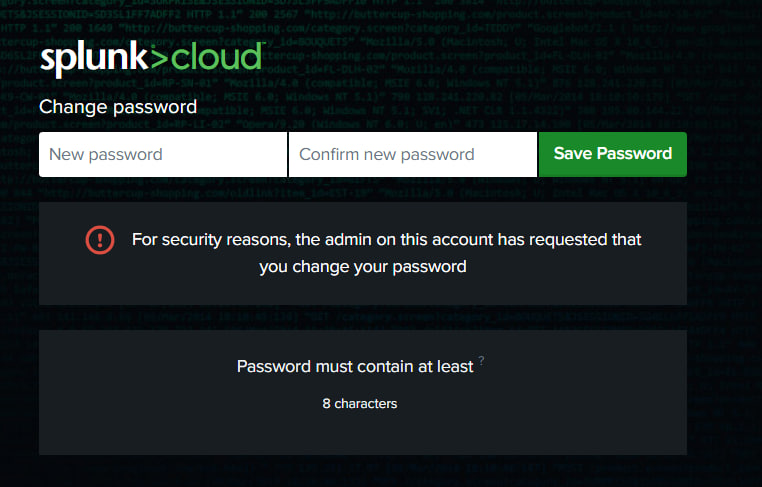
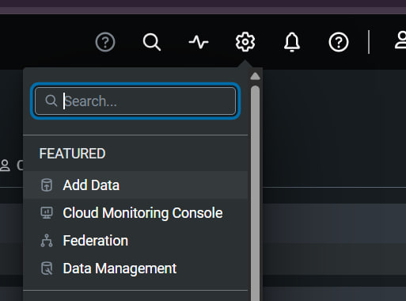
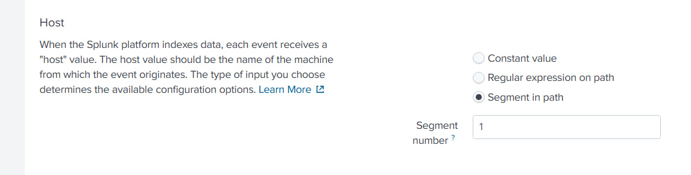
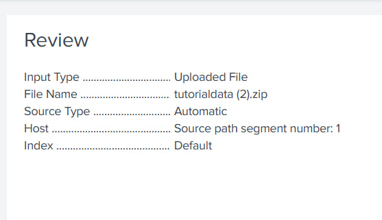
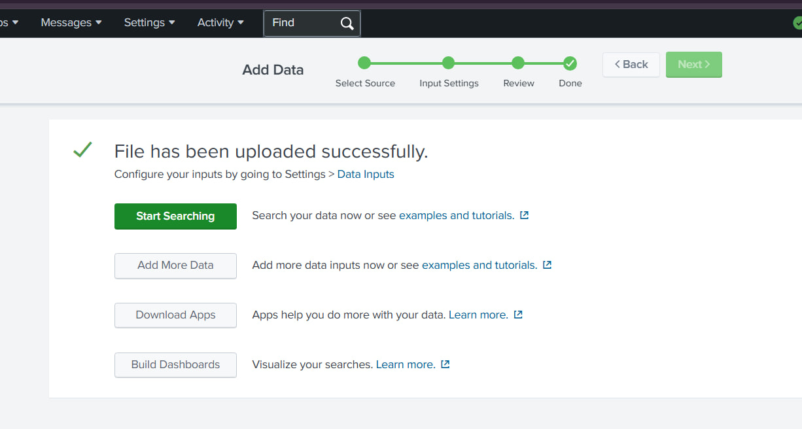
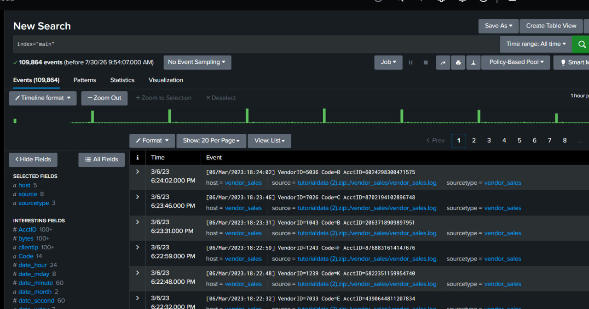
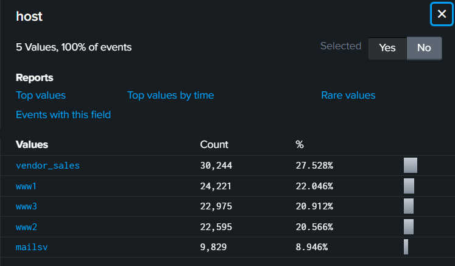
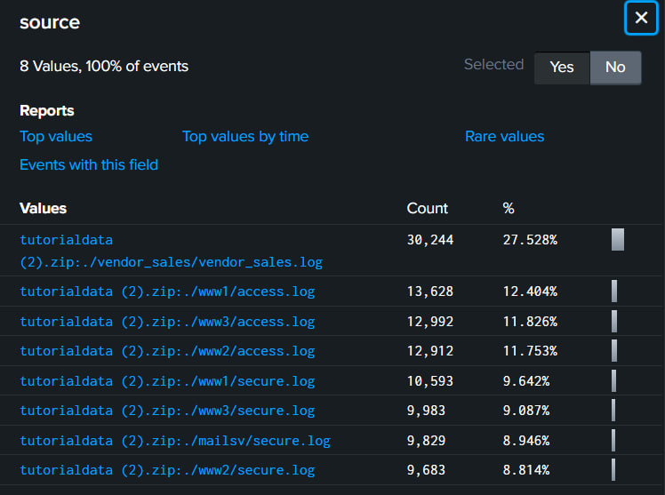
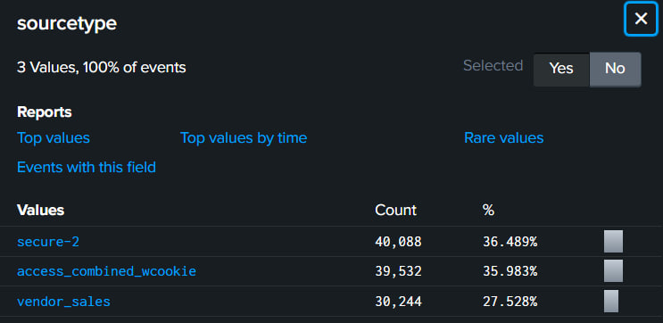
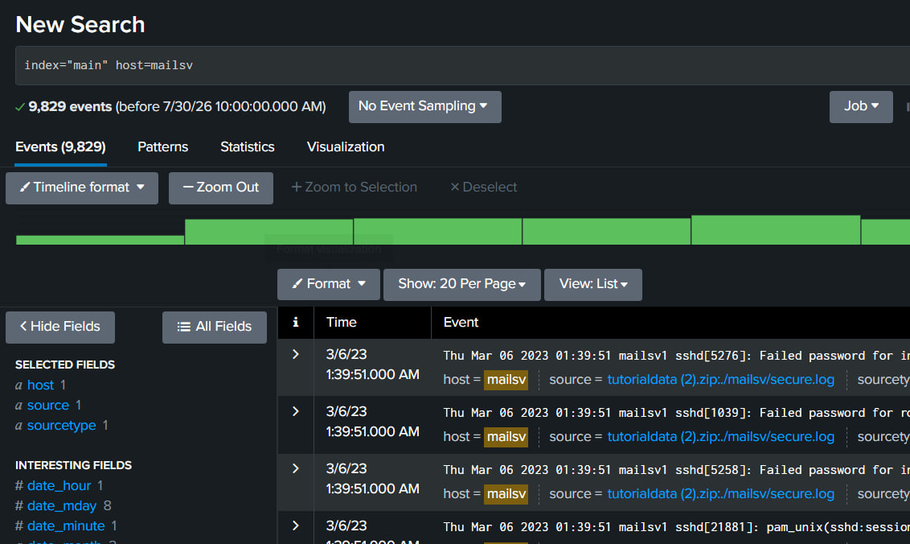

### Крок 1: Реєстрація облікового запису Splunk
Переходимо на сторінку Splunk Cloud Platform Trial. Заповн.ємо реєстраційну форму «Start Your Cloud Platform Trial»: Business Email, Password, First Name, Last Name, Job Title, Phone Number, Company, Country (Ukraine), Zip/Postal Code. Погоджуємось з умовами використання (Terms & Conditions) та натискаємо Create Your Account.

### Крок 2. Підтвердження електронної пошти
Перевіряємо поштову скриньку — надійшов лист від Splunk з темою «Confirm your email address». Відкриваємо лист і натискаємо кнопку Verify Your Email.

### Крок 3. Активація безкоштовного пробного періоду Splunk Cloud
Після підтвердження пошти автоматично переходимо на сторінку Splunk Cloud Trial. Натискаємо кнопку Start Trial. Отримуємо лист від Splunk з темою «Welcome to Splunk Cloud Platform!», що містив дані для входу (логін, тимчасовий пароль) і посилання на середовище. Переходимо за посиланням, вводимо отримані логін і пароль. Змінюємо тимчасовий пароль на новий і натискаємо Save Password.


Приймаємо умови використання (чекбокс I accept these terms) і підтверджуємо.

### Крок 4. Завантаження даних у Splunk
Переходимо на Splunk Home Dashboard. У Splunk bar відкриваємо Settings → Add Data.


Обираємо спосіб додавання даних — Upload. Натискаємо Select File і завантажуємоархів tutorialdata.zip (без розпакування), що містить логи Buttercup Games (папки mailsv, vendor_sales, www1, www2, www3). Натискаємо Next для переходу до Input Settings. У розділі Host обираємо опцію Segment in path та вказуємо сегмент 1. 


Перевіряємо деталі на кроці Review:
Input Type: Uploaded File
File Name: tutorialdata.zip
Source Type: Automatic
Host: Source path segment number: 1
Index: Default


Натискаємо Submit — отримуємо підтвердження успішного завантаження файлу.


### Крок 5. Перевірка індексації даних
Повертаємось на Splunk Home, відкриваємо Search & Reporting. У пошуковому рядку вводимо запит:
```sh
 index=main
```
Обираємо часовий діапазон All Time. Виконуємо пошук — отримано 109 864 події (events), що підтверджує успішне завантаження й індексацію даних.


### Крок 6. Аналіз полів даних 
Переглядаємо значення полів у блоці SELECTED FIELDS:
host (5 значень): mailsv, www1, www2, www3, vendor_sales


source (8 значень), серед них — /mailsv/secure.log


sourcetype (3 значення), серед них — secure-2


### Крок 7. Звуження пошуку до мейл-сервера
Додаємо до запиту фільтр по хосту:
```sh
index=main host=mailsv
```
Результат — понад 9000 подій, згенерованих мейл-сервером.


